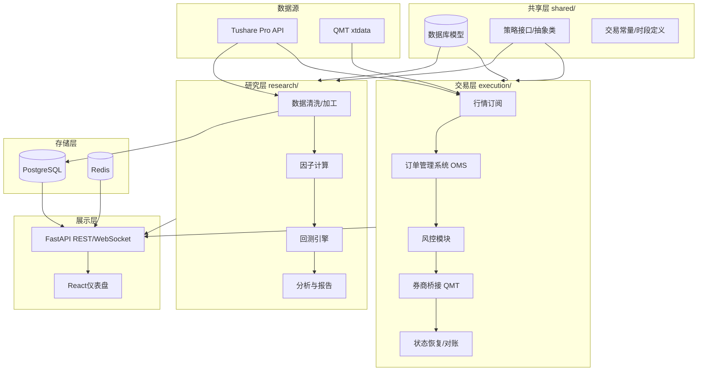

# AI Trade - 股票量化交易系统总体规划

---

## 一、推荐技术栈

### 后端 (Python生态，与QMT/Tushare天然兼容)

- **Web框架**: FastAPI (异步高性能，天然WebSocket支持)
- **数据库**: PostgreSQL (结构化金融数据, 原生分区) + Redis (实时行情缓存/消息队列)
- **数据库演进**: 初期纯PostgreSQL分区 -> 后期按需升级TimescaleDB (100%兼容迁移)
- **ORM**: SQLAlchemy 2.0 (异步支持)
- **任务调度**: APScheduler (定时拉取数据) / Celery (重计算任务)
- **数据处理**: Pandas + NumPy + PyArrow (Parquet读写)
- **数据源**: Tushare Pro SDK
- **实盘接口**: xtquant (QMT的Python库)

### 前端 (专业交易面板，高度定制化)

- **框架**: React 19 + TypeScript + Vite
- **UI库**: Ant Design 5 (暗色主题，适合金融面板) + TailwindCSS
- **K线图表**: klinecharts (内置技术指标, A股红涨绿跌, Canvas高性能渲染)
- **实时通信**: WebSocket (行情推送)
- **状态管理**: Zustand (轻量) + React Query (服务端状态)
- **路由**: React Router v7

### 选择理由

- Python后端：与Tushare SDK和QMT xtquant完美兼容，无需跨语言桥接
- React前端：生态最成熟，TradingView Charts等金融级组件库丰富，长期维护性最好
- FastAPI：原生async支持WebSocket实时推送分钟行情，性能远优于Flask/Django
- 不选Electron：初期Web版足够，后期如需桌面应用可用Tauri包装

---

## 二、系统架构总览 (Research / Execution 分层)

### 2.1 核心原则：研究层与交易层隔离

项目从Day 1起在逻辑上严格划分为 **Research (研究层)** 和 **Execution (交易层)**：

- 两层之间 **禁止直接import内部实现**，只能通过 `shared/interfaces/` 中定义的抽象接口通信
- 一个策略类同时满足回测和实盘的接口契约，但底层实现完全不同
- UI/API层作为独立的展示层，不属于任何一层，通过接口调用两层的服务

Phase 1-3 阶段为同一进程内的逻辑分层 (package级隔离)；Phase 5 对接QMT前评估是否需要物理拆分为独立进程。

### 2.2 架构图




### 2.3 两层职责对比


| 维度   | Research (研究层)           | Execution (交易层)                    |
| ---- | ------------------------ | ---------------------------------- |
| 核心目标 | 发现可靠的交易策略                | 安全准确地执行策略                          |
| 数据来源 | 历史数据 (DB/Tushare按需拉取)    | 实时行情 (Tushare rt_min / QMT xtdata) |
| 容错要求 | 低 — 错了重跑即可               | 极高 — 错了就是真金白银                      |
| 性能要求 | 吞吐量优先 (批量处理)             | 延迟优先 (毫秒级响应)                       |
| 代码风格 | 可以用Pandas批量计算            | 必须逐笔处理，状态机驱动                       |
| 测试方式 | 回测报告 + 统计检验              | 模拟盘对拍 + 对账校验                       |
| 包含模块 | 数据清洗、因子计算、回测引擎、参数搜索、报告输出 | 行情订阅、OMS、风控、券商桥接、故障恢复、对账           |


### 2.4 策略接口契约 (shared/interfaces/)

研究层和交易层共用同一个策略抽象接口，确保回测通过的策略可以直接对接实盘，不需要重写：

```python
class IStrategy(ABC):
    """策略接口 - 研究层和交易层共用"""
    
    @abstractmethod
    def on_bar(self, bar: BarData) -> list[Signal]:
        """收到新K线时触发，返回交易信号列表"""
        ...
    
    @abstractmethod
    def on_order_update(self, order: OrderUpdate) -> None:
        """订单状态变化回调"""
        ...

class Signal:
    ts_code: str
    direction: Literal['BUY', 'SELL']
    price_type: Literal['MARKET', 'LIMIT']
    price: float | None
    volume: int
    reason: str  # 便于报告追溯
```

- 回测引擎 (`research/backtest/`) 调用 `strategy.on_bar()` 喂历史数据
- 实盘引擎 (`execution/feed/`) 调用同一个 `strategy.on_bar()` 喂实时数据
- 信号不直接下单，而是发给 OMS，由 OMS 经风控后决定是否执行

---

## 三、渐进式数据存储策略

### 3.1 核心原则

不过早引入复杂存储架构。初期用纯PostgreSQL + 原生分区满足需求，等项目成熟后再平滑升级到TimescaleDB压缩。

### 3.2 数据量估算

A股约5300只股票，每日240分钟交易时间，年250交易日：


| 数据类型               | 全历史行数         | 全历史大小(未压缩含索引) | 实际存储策略        |
| ------------------ | ------------- | ------------- | ------------- |
| 日线行情 (daily)       | ~3000万行 (17年) | ~3-5GB        | **全量入库**，忽略不计 |
| 每日指标 (daily_basic) | ~3000万行       | ~5GB          | **全量入库**      |
| 财务数据 (income等)     | ~200万行        | <1GB          | **全量入库**      |
| 1分钟K线 (历史)         | ~54亿行 (17年)   | ~850GB        | **仅存近1-2年**   |
| 1分钟K线 (实时)         | ~127万行/天      | ~200MB/天      | **实时写入，滚动保留** |
| 指数/行业日线            | ~500万行        | ~1GB          | **全量入库**      |
| 新闻/公告              | 数十万条          | ~2GB          | **全量入库**      |


### 3.3 分阶段存储方案

**Phase 1-2 (初期)：纯PostgreSQL + 原生表分区**

```
存储总量预估: ~60-110GB
├── 日线/周线/月线/指标: ~15GB (全量, 无需担心)
├── 1分钟K线(近1-2年): ~50-100GB (按月分区)
├── 财务/基础/新闻等: ~5GB
└── 模拟交易记录: <1GB
```

- 分钟数据按月分区 (`PARTITION BY RANGE (trade_time)`)
- 只从Tushare拉取最近1-2年的分钟历史数据入库
- 一块256GB SSD完全足够

关键SQL：

```sql
-- 按月分区的分钟K线表
CREATE TABLE stock_min_kline (
    ts_code    VARCHAR(10) NOT NULL,
    trade_time TIMESTAMP   NOT NULL,
    open       FLOAT8,
    close      FLOAT8,
    high       FLOAT8,
    low        FLOAT8,
    vol        FLOAT8,
    amount     FLOAT8,
    PRIMARY KEY (ts_code, trade_time)
) PARTITION BY RANGE (trade_time);

-- 每月一个分区 (示例)
CREATE TABLE stock_min_kline_2026_03
    PARTITION OF stock_min_kline
    FOR VALUES FROM ('2026-03-01') TO ('2026-04-01');
```

**Phase 3-4 (需要更多回测数据时)：按需从Tushare拉取**

- 回测引擎运行时，检查本地是否有所需时间段的分钟数据
- 如果没有，实时从Tushare API拉取 (历史分钟接口: 500次/分钟, 8000行/次)
- 拉取后可选是否缓存到本地（临时文件或入库）
- 封装统一DataLoader，对策略层透明

```python
class DataLoader:
    """统一数据加载器 - 策略层无需关心数据来源"""
    
    async def get_min_kline(self, ts_code, start, end, freq='1min'):
        # 1. 先查本地数据库
        local_data = await self._query_db(ts_code, start, end, freq)
        if local_data is not None and len(local_data) > 0:
            return local_data
        # 2. 本地没有，从Tushare拉取
        remote_data = await self._fetch_tushare(ts_code, start, end, freq)
        return remote_data
```

**Phase 5+ (项目成熟后，可选升级)：TimescaleDB压缩**

当满足以下任一条件时考虑升级：

- 需要存储全量历史分钟数据 (>2年)
- 磁盘空间开始紧张
- 查询性能需要优化

升级步骤 (TimescaleDB 100%兼容PostgreSQL)：

1. 安装TimescaleDB扩展 (Docker方式最简单)
2. `SELECT create_hypertable('stock_min_kline', 'trade_time', migrate_data => true)`
3. 配置自动压缩策略 (3个月前数据自动压缩)
4. 存储从 ~100GB 降至 ~10-15GB

### 3.4 冷数据归档 (远期可选)

对于3年以上的分钟数据，可导出为Parquet列式文件：

- 使用PyArrow导出，按 `年/月/股票代码` 目录组织
- Parquet压缩率约5-10x (与TimescaleDB互补)
- 回测引擎通过DataLoader统一访问
- 可存放在机械硬盘或网络存储上

---

## 四、Git/GitHub 版本管理策略

### 4.1 仓库初始化

```bash
git init
git remote add origin https://github.com/<your-username>/ai-trade.git
```

### 4.2 分支策略 (GitHub Flow 简化版)

- `main`: 稳定可运行版本，每个Phase完成后合并
- `dev`: 日常开发分支
- `feature/<phase>-<module>`: 功能分支，如 `feature/p1-tushare-service`, `feature/p2-kline-chart`

### 4.3 提交规范

```
<type>(<scope>): <description>

type: feat / fix / refactor / docs / chore / test
scope: backend / frontend / data / trade / strategy
```

示例：`feat(data): add Tushare daily data sync service`

### 4.4 .gitignore 关键条目

```
# Python
__pycache__/
*.pyc
.venv/
*.egg-info/

# Frontend
node_modules/
dist/

# 敏感信息
.env
.env.local
*.secret

# 数据文件
*.db
*.sqlite
data/cache/

# IDE
.vscode/
.idea/

# Cursor (rules需要提交, 但plans不提交)
.cursor/plans/
```

### 4.5 里程碑 (GitHub Milestones)

每个Phase对应一个GitHub Milestone，用Issues跟踪子任务：

- **v0.1.0** - Phase 1: 基础架构 + 数据层
- **v0.2.0** - Phase 2: 仪表盘UI
- **v0.3.0** - Phase 3: 实时数据 + 模拟交易
- **v0.4.0** - Phase 4: 策略 + 回测
- **v0.5.0** - Phase 5: QMT实盘
- **v1.0.0** - Phase 6: AI增强 (首个完整版)

### 4.6 需要提交到Git的Cursor配置

```
.cursor/rules/*.mdc   # 项目AI规则 (必须提交)
AGENTS.md              # 项目记忆文件 (必须提交)
```

---

## 五、Tushare "总包" 权限分析

Tushare的权限分为**两大类**，你说的"总包"很可能涵盖了以下全部：

### 表一：积分接口（应拥有 10000~15000+ 积分）

- **股票数据**: daily(日线), weekly(周线), monthly(月线), pro_bar(复权行情), daily_basic(每日指标), moneyflow(资金流向), stk_limit(涨跌停价), hk_hold(沪深股通) 等 20+ 接口
- **财务数据**: income(利润表), balancesheet(资产负债表), cashflow(现金流), forecast(业绩预告), fina_indicator(财务指标) 等 10+ 接口
- **指数数据**: index_basic, index_daily, index_weekly, index_weight, index_dailybasic, index_classify 等
- **基金数据**: fund_basic, fund_nav, fund_daily, fund_portfolio, fund_adj 等
- **期货/期权**: fut_basic, fut_daily, fut_holding, opt_basic, opt_daily 等
- **债券数据**: cb_basic, cb_issue, cb_daily (可转债全系列)
- **宏观经济**: shibor, libor, hibor, shibor_lpr 等利率数据
- **特色数据(10000+积分)**: 盈利预测、筹码分布、券商金股等

### 表二：独立权限接口（需单独付费，总包应全含）

- **股票历史分钟** (1/5/15/30/60min, 2009年起, 2000元/年)
- **股票实时分钟** (实时推送, 1000元/月)
- **股票实时日线** (盘中实时, 200元/月)
- **指数实时日线** (盘中实时, 200元/月)
- **ETF实时日线** (盘中实时, 200元/月)
- **新闻资讯** (快讯、长篇新闻、新闻联播, 1000元/年)
- **公告信息** (10年+历史, 1000元/年)
- **期货历史/实时分钟** (2010年起, 各2000元/年和1000元/月)
- **港股日线/分钟** (全历史, 各1000/2000元/年)
- **美股日线** (全历史, 2000元/年)
- **集合竞价数据** (500元)
- **券商研报库** (500元)
- 等等

> **建议**: 登录 [https://tushare.pro/weborder/#/permission](https://tushare.pro/weborder/#/permission) 查看你账户的确切权限状态和积分数，截图给我确认。这样我可以精确规划哪些功能可以直接用Tushare数据。

### 4.1 你的Tushare Skill资产盘点

你的 `.cursor/skills/skill-tushare-data/` 包含 **237个接口参考文档**，覆盖以下全部类目：


| 类目           | 接口数量 | 核心接口举例                                           |
| ------------ | ---- | ------------------------------------------------ |
| 股票行情数据       | 20+  | daily, rt_k(实时日线), rt_min(实时分钟), 历史分钟, 周/月线      |
| 股票基础数据       | 15+  | stock_basic, trade_cal, stk_limit, IPO新股         |
| 股票特色数据       | 12+  | 筹码分布, 筹码及胜率, 技术面因子, 券商金股, 集合竞价                   |
| 股票财务数据       | 10+  | income, balancesheet, cashflow, fina_indicator   |
| 资金流向数据       | 7+   | moneyflow, 沪深港通资金, 行业/板块/大盘资金流向(THS/DC)          |
| 打板专题         | 18+  | 龙虎榜, 涨跌停榜单, 连板天梯, 同花顺/东财/通达信板块                   |
| 两融及转融通       | 6+   | margin, margin_detail                            |
| 指数专题         | 18+  | index_daily, 申万行业, 中信行业, 指数实时分钟/日线               |
| ETF专题        | 8+   | ETF基本信息, ETF日线, ETF实时分钟/日线, ETF份额规模              |
| 公募基金         | 8+   | fund_basic, fund_nav, fund_daily, fund_portfolio |
| 期货数据         | 12+  | fut_basic, fut_daily, 期货实时/历史分钟, 期货Tick          |
| 期权数据         | 3+   | opt_basic, opt_daily, 期权分钟                       |
| 债券/可转债       | 12+  | cb_basic, cb_daily, 可转债技术面因子                     |
| 港股数据         | 10+  | hk_basic, hk_daily, 港股分钟, 港股财报                   |
| 美股数据         | 8+   | us_basic, us_daily, 美股财报                         |
| 宏观经济         | 12+  | GDP, CPI, PPI, PMI, Shibor, LPR, 货币供应量           |
| 大模型语料        | 7+   | 新闻快讯, 长篇新闻, 上市公司公告, 券商研报, 国家政策库                  |
| 行业经济/现货/财富管理 | 10+  | 电影票房, 黄金现货, 基金销售                                 |


---

## 六、分阶段实施计划 (含Tushare接口映射)

> 每个Phase标注了对应的Tushare Skill参考文档路径，开发时可通过 `@skill-tushare-data` 引用。

### Phase 1: 项目基础与数据层

> **AI执行约束**: 每次新对话开始前，必须先读本计划文件，确认当前进度再动手。

#### Phase 1-MVP: 最小起步 -- 半年日线数据跑通 (当前执行)

**目标**: 用最少代码跑通 "项目骨架 -> Tushare连接 -> 半年日线入库" 闭环

**MVP边界 (不许越界)**:

- 不建分钟表/分区表
- 不做前端
- 不做Redis缓存
- 不做DataLoader抽象层
- 不做增量同步 (先全量跑通)
- 不接QMT
- 不重构无关模块

**Step 1: 防遗忘硬约束 (先于一切代码)**

创建 `.cursor/rules/project-overview.mdc` (alwaysApply: true):

- 先做MVP，不许扩范围
- 每次新对话先读 `.cursor/plans/` 下的计划文件确认当前步骤
- 每次改动前先更新任务状态 (本文件frontmatter的todos)
- 不允许直接重构无关模块
- QMT桥接与研究层隔离
- 任何新增功能都要写回计划文件
- Python 3.10+，禁止Python 2

创建 `AGENTS.md` (项目记忆):

- 当前Phase进度
- 已完成/进行中 任务
- 关键决策记录

**Step 2: 项目骨架 (最小结构)**

```
Qmt_forme/
  backend/
    app/
      core/config.py          # Settings (DB_URL, TUSHARE_TOKEN from env)
      core/database.py        # SQLAlchemy async engine + session
      shared/models/          # stock_basic, trade_cal, stock_daily
      research/data/
        tushare_service.py    # Tushare封装 (token/频次/重试)
      main.py                 # FastAPI入口 (极简)
    alembic/                  # DB迁移
    requirements.txt
  scripts/
    init_data.py              # 数据拉取脚本
  .env / .env.example
  .gitignore
```

依赖: fastapi, uvicorn, sqlalchemy[asyncio], asyncpg, alembic, tushare, pandas, python-dotenv

**Step 3: 数据库表 (只建3张)**

- **stock_basic**: ts_code(PK), name, area, industry, market, list_date, list_status, exchange
- **trade_cal**: exchange, cal_date(PK), is_open, pretrade_date
- **stock_daily**: ts_code, trade_date, open, high, low, close, pre_close, change, pct_chg, vol, amount -- 联合主键(ts_code, trade_date), 普通表不分区

**Step 4: Tushare服务封装**

- 统一token管理 (从环境变量 TUSHARE_TOKEN 读取)
- 频次控制: daily接口限200次/分钟，stock_basic/trade_cal无严格限制
- 错误重试: 网络异常自动重试3次，指数退避
- 参考 `@skill-tushare-data` 中 `references/股票数据/行情数据/历史日线.md` 和 `references/股票数据/基础数据/股票列表.md`

**Step 5: 数据拉取 (半年范围: 2025-09-22 ~ 2026-03-21)**

执行顺序:

1. `stock_basic` -- 全量拉取当前上市股票列表 (约5000只)
2. `trade_cal` -- 拉取SSE交易日历 (半年约120个交易日)
3. `daily` -- 按交易日逐日拉取: 每次请求1个trade_date获取全市场当日行情，约120次请求，远低于200次/分钟限制

**验证标准**: 脚本跑完后，数据库中 stock_basic 约5000行, trade_cal 约120行(is_open=1), stock_daily 约60万行

#### Phase 1-后续 (MVP跑通后再做)

- 分钟K线表 + PostgreSQL原生按月分区 (参见第三章存储策略)
- 分钟数据拉取 (仅拉近1-2年)
- daily_basic (每日指标PE/PB/换手率)
- 指数数据 (index_basic, index_daily)
- 申万行业分类 (index_classify, index_member_all)
- DataLoader统一数据访问层
- Redis缓存层
- 增量同步机制 (skill-tushare-sync)

**Tushare接口 (基础数据入库)**:


| UI/功能需求         | Tushare接口          | Skill参考路径                       |
| --------------- | ------------------ | ------------------------------- |
| 股票代码库           | `stock_basic`      | `references/股票数据/基础数据/股票列表.md`  |
| 交易日历            | `trade_cal`        | `references/股票数据/基础数据/交易日历.md`  |
| 历史日线行情          | `daily`            | `references/股票数据/行情数据/历史日线.md`  |
| 复权行情            | `pro_bar`          | `references/股票数据/行情数据/复权行情.md`  |
| 每日指标(PE/PB/换手率) | `daily_basic`      | `references/股票数据/行情数据/每日指标.md`  |
| 指数基础信息          | `index_basic`      | `references/指数专题/指数基本信息.md`     |
| 指数日线行情          | `index_daily`      | `references/指数专题/指数日线行情.md`     |
| 申万行业分类          | `index_classify`   | `references/指数专题/申万行业分类.md`     |
| 申万行业成分          | `index_member_all` | `references/指数专题/申万行业成分(分级).md` |


### Phase 2a (P2-Core): 交易控制台 (约1.5周) -- 交易闭环必需

**目标**: 只实现交易链路直接依赖的UI面板，确保Phase 3 OMS/风控有前端可用

```
+------------------------------------------------------------+
| Header: AI Trader品牌栏                    | 资产总览        |
+----------+-------------------------------------------------+
| 左侧导航 | 今日交易计划 (表格)         | K线图表+指标    |
| - 仓单   |                             |                 |
| - 策略   +-----------------------------+-----------------+
| - 历史   | 持仓/订单/成交面板              | 风控状态面板    |
| - 持仓   |                              |                 |
| - 回测   +--------------------------------------------+   |
| - 调研   | 策略开关 + 日志/告警区域                          |   |
+----------+----------------------------------------------+---+
```

**P2-Core 面板清单**:

- **K线图表**: 个股历史K线 + 实时分钟叠加, 技术指标(MA/MACD/VOL)
- **今日交易计划表格**: 手动/策略生成的买卖计划, 实时价格更新
- **持仓/订单/成交面板**: 为Phase 3 OMS提供前端 (当前可用Mock数据)
- **资产总览**: 总资产/可用资金/浮动盈亏/当日盈亏
- **风控状态面板**: 为Phase 3风控模块提供前端 (风控规则状态/触发记录/Kill Switch按钮)
- **策略开关面板**: 已注册策略列表, 启用/停用/参数概览
- **日志/告警区域**: 系统日志 + 异常告警滚动展示
- **左侧导航骨架 + 暗色主题框架**: 全局布局, 后续P2-Plus面板直接填入

**P2-Core Tushare接口映射**:


| UI模块         | 数据来源(Tushare接口)                | Skill参考路径                                                       |
| ------------ | ------------------------------ | --------------------------------------------------------------- |
| **K线图表**     | `daily`(历史K线) + `rt_min`(实时分钟) | `references/股票数据/行情数据/历史日线.md` + `references/股票数据/行情数据/实时分钟.md` |
| **今日交易计划表格** | `rt_k`(实时价格) + 本地交易计划          | `references/股票数据/行情数据/实时日线.md`                                  |
| **资产总览**     | 本地模拟账户数据 (无需Tushare)           | --                                                              |
| **持仓/订单/成交** | 本地OMS数据 (无需Tushare)            | --                                                              |
| **风控状态**     | 本地风控模块数据 (无需Tushare)           | --                                                              |
| **策略开关**     | 本地策略注册表 (无需Tushare)            | --                                                              |

> **P2-Core UI 重构详情**: 见 [p2-core_ui重构_688581cd.plan.md](p2-core_ui重构_688581cd.plan.md)  
> 包含: 设计Token层、Panel通用组件、8个面板组件重写、Dashboard瘦身、Storybook集成

---

### Phase 2b (P2-Plus): 资讯仪表盘 (模拟盘闭环后, 约2周)

**前置条件**: Phase 3 模拟盘跑通后再开始，避免分散精力

**目标**: 补充截图中其余的资讯/行情大屏面板，增强信息获取能力

**P2-Plus 面板清单**:

- 顶部涨跌统计卡片 (涨势/合约完成/热点)
- 行业涨幅TOP
- 经济数据面板
- 股票涨幅TOP / 板块TOP
- 北向资金 / 资金流向
- 新闻滚动区
- 个股信息/公告
- 个人收入TOP

**P2-Plus Tushare接口映射**:


| UI模块          | 数据来源(Tushare接口)                                      | Skill参考路径                                                                    |
| ------------- | ---------------------------------------------------- | ---------------------------------------------------------------------------- |
| **顶部 - 涨跌统计** | `rt_k`(实时日线) 统计涨/跌/平家数                               | `references/股票数据/行情数据/实时日线.md`                                               |
| **行业涨幅TOP**   | `申万行业指数日行情` 或 `同花顺概念和行业指数行情`                         | `references/指数专题/申万行业指数日行情.md` + `references/股票数据/打板专题数据/同花顺概念和行业指数行情.md`    |
| **经济数据**      | `shibor`, `shibor_lpr`, `cn_cpi`, `cn_ppi`, `cn_gdp` | `references/宏观经济/国内宏观/利率数据/` + `references/宏观经济/国内宏观/价格指数/`                  |
| **股票涨幅TOP**   | `rt_k`(实时日线) 按涨幅排序                                   | `references/股票数据/行情数据/实时日线.md`                                               |
| **板块TOP**     | `同花顺行业概念板块` + `东方财富概念板块`                             | `references/股票数据/打板专题数据/同花顺行业概念板块.md` + `references/股票数据/打板专题数据/东方财富概念板块.md` |
| **北向资金/北三板**  | `沪深股通持股明细` + `沪深港通资金流向`                              | `references/股票数据/特色数据/沪深股通持股明细.md` + `references/股票数据/资金流向数据/沪深港通资金流向.md`    |
| **个人收入TOP**   | 本地模拟交易盈亏统计                                           | --                                                                           |
| **个股信息/公告**   | `上市公司公告` + `上市公司基本信息`                                | `references/大模型语料专题数据/上市公司公告.md` + `references/股票数据/基础数据/上市公司基本信息.md`        |
| **新闻滚动**      | `新闻快讯(短讯)` + `新闻通讯(长篇)`                              | `references/大模型语料专题数据/新闻快讯(短讯).md` + `references/大模型语料专题数据/新闻通讯(长篇).md`      |
| **资金流向**      | `moneyflow` + `行业资金流向(THS)`                          | `references/股票数据/资金流向数据/个股资金流向.md` + `references/股票数据/资金流向数据/行业资金流向(THS).md` |


### Phase 3: 实时数据流 + OMS/模拟交易引擎 (约3-4周)

> **Phase 3 分步执行计划**: 见 [p3-realtime-oms.plan.md](p3-realtime-oms.plan.md)  
> 包含: 10个Step (Redis→接口协议→DB模型→OMS→风控→撮合→行情Feed→API→可观测性→前端对接)

**目标**: 实现实时行情推送、OMS订单管理系统、风控模块、分钟级模拟交易

> **模拟盘适用边界**: 本系统的模拟盘基于分钟K线驱动撮合，默认服务于中低频策略（日线/60分钟/15分钟级别）的验证。**不作为超短线/打板/盘口博弈类策略的真实成交代理。** 这类策略需要逐笔(tick)/订单簿级仿真，超出当前系统设计范围。模拟盘收益仅供策略筛选参考，不等同于实盘可复现收益。

**开发任务**:

- **Phase 3 前置: Redis安装与配置**:
  - 安装Redis (Windows: Memurai/WSL Redis, Linux/macOS: 原生Redis)
  - 后端添加 redis 依赖 (redis[hiredis])
  - `backend/app/core/redis.py`: Redis连接池配置 (从 `REDIS_URL` 环境变量读取)
  - `.env.example` 添加 `REDIS_URL=redis://localhost:6379/0`
  - 验证连通性
- **行情订阅 (execution/feed/)**:
  - WebSocket实时行情推送管道 (Tushare实时分钟 -> Redis -> WebSocket -> 前端)
  - 行情数据标准化 (统一 BarData 格式, 遵循 shared/interfaces/)
- **OMS 订单管理系统 (execution/oms/)** -- 本Phase核心新增:
  - 订单状态机: `PENDING -> SUBMITTED -> PARTIAL_FILLED -> FILLED / CANCELED / REJECTED`
  - 订单幂等性: 相同信号在窗口期内不重复下单 (signal_id去重)
  - 重复信号防护: 同一股票同方向信号在N分钟内仅执行一次
  - 持仓账本 (position_book): 本地实时持仓 (股票/数量/成本/浮动盈亏)
  - 资金账本: 总资产/可用资金/冻结资金/已实现盈亏
  - 成交回报处理: 更新持仓账本 + 记录成交日志
  - 收盘结算: 交易日结束时持仓市值重算 + 当日盈亏统计
- **风控模块 (execution/risk/)** -- 本Phase核心新增:
  - **下单前风控 (pre_trade)**:
    - 单票仓位上限 (默认不超过总资产20%)
    - 单笔金额上限
    - 当日买入次数上限
    - 涨跌停价格校验 (涨停不买、跌停不卖)
    - 停牌/ST股票拦截
    - 可用资金充足性检查
  - **盘中实时风控 (realtime)**:
    - 账户级最大回撤预警/停机 (当日亏损超过N%暂停交易)
    - 单票亏损超限平仓
    - 异常波动检测 (个股瞬间涨跌超过阈值, 暂缓下单)
  - **Kill Switch (kill_switch)**: 一键暂停所有交易信号、可选全部市价清仓
- **最小可观测性层 (execution/observability/)** -- 生产运维基础:
  - 心跳监控: 各模块(行情订阅/OMS/风控/撮合)定时发心跳到Redis, 超时报警
  - 数据延迟监控: 实时行情最后更新时间 vs 当前时间, 超过阈值(如2分钟)报警
  - 下单成功率: 统计近N笔订单的提交/成交/拒绝比例, 异常时告警
  - 当日异常摘要: 收盘后自动汇总(风控拦截次数/数据缺失/连接中断/被过滤订单等)
  - 关键事件审计日志: 所有下单/撤单/风控触发/Kill Switch操作写入不可变审计表(audit_log), 不可删改
  - 日志/告警推送到前端 (P2-Core的日志/告警区域)
- **模拟撮合引擎 (research/backtest/matcher.py 复用)**:
  - 基于实时分钟数据撮合 (市价单用下一bar开盘价, 限价单检查是否触及)
  - 手续费模型 (印花税0.05%卖出, 佣金万2.5双向, 沪市过户费0.001%双向)
  - 滑点模型 (固定滑点 + 基于成交量的冲击模型)
- **交易面板UI**: 下单/撤单/持仓查看/交易历史/风控状态/Kill Switch按钮

**Tushare接口 (实时数据驱动)**:


| 功能需求      | Tushare接口                  | Skill参考路径                                                     |
| --------- | -------------------------- | ------------------------------------------------------------- |
| 实时分钟K线    | `rt_min` (1/5/15/30/60MIN) | `references/股票数据/行情数据/实时分钟.md`                                |
| 盘中实时日线    | `rt_k` (全市场实时快照)           | `references/股票数据/行情数据/实时日线.md`                                |
| 指数实时行情    | 指数实时日线/分钟                  | `references/指数专题/指数实时日线.md` + `references/指数专题/指数实时分钟.md`     |
| ETF实时行情   | ETF实时日线/分钟                 | `references/ETF专题/ETF实时日线.md` + `references/ETF专题/ETF实时分钟.md` |
| 涨跌停价格(风控) | `stk_limit`                | `references/股票数据/行情数据/每日涨跌停价格.md`                             |
| 停复牌信息(过滤) | `suspend_d`                | `references/股票数据/行情数据/每日停复牌信息.md`                             |
| 集合竞价数据    | `开盘竞价成交(当日)`               | `references/股票数据/打板专题数据/开盘竞价成交(当日).md`                        |
| 申万实时行情    | `申万实时行情`                   | `references/指数专题/申万实时行情.md`                                   |


### Phase 4: 策略框架与回测系统 (约3-4周)

**目标**: 可视化策略编辑、参数调优、历史回测。**回测可信性优先于回测功能丰富性。**

#### 4a. 回测可信性规则 (先定规则，再写代码)

在编写回测引擎之前，必须先定义以下可信性规则，作为回测引擎的硬约束，写入 `.cursor/rules/backtest-rules.mdc`：

**信号执行时机**:

- bar内信号必须在**下一个bar的开盘价**执行，禁止在当前bar内成交 (防止偷看未来)
- 日线策略: 今天收盘信号 -> 明天开盘执行
- 分钟策略: 当前bar结束信号 -> 下一个bar开盘执行

**不可交易情况过滤**:

- 涨停板 (买入方向): 如果目标价 >= 涨停价，视为无法买入，订单取消
- 跌停板 (卖出方向): 如果目标价 <= 跌停价，视为无法卖出，订单取消
- 一字板 (涨停/跌停且开盘=收盘): 完全不可交易
- 停牌股票: 自动跳过，通过 `suspend_d` 接口校验
- ST/ST股票: 涨跌停限制改为±5% (非±10%)
- 新股上市首日: 不参与交易 (规则特殊)

**复权口径一致性**:

- 回测统一使用**后复权** (hfq) 计算收益，避免前复权基准日漂移问题
- 买卖价格使用**不复权**真实价格计算手续费和滑点
- 所有技术指标基于后复权价格计算，保证连续性

**幸存者偏差处理**:

- 股票池必须使用**时点股票列表** (point-in-time)，不能用当前上市股票列表回测历史
- 已退市股票必须包含在回测中 (Tushare `stock_basic` 的 `list_status='D'` 退市股票)
- 指数成分股使用**历史成分** (`index_weight` 按月获取历史成分和权重)

**未来函数检测**:

- 回测引擎在每个时间步只能访问当前时间及之前的数据
- 财务数据使用**披露日期** (而非报告期) 作为可用时间点
- 行业分类、指数成分变更需要按时间回溯

**滑点与费用模型 (A股专用)**:

- 手续费: 佣金万2.5双向 + 印花税0.05%卖出 + 沪市过户费0.001%双向
- 滑点: 基础滑点1个tick + 基于成交量的冲击成本 (订单量/当日成交量 > 1% 时冲击加大)
- 最小交易单位: 100股 (1手), 卖出可以不足100股

**分钟级回测特殊规则**:

- 1分钟bar的开盘价不等于真实可成交价，需要额外加滑点
- 成交量限制: 单笔订单不超过该bar成交量的20% (避免虚假流动性)
- 9:30的第一个bar因集合竞价影响，开盘价可能跳空，需特殊处理

#### 4b. 开发任务

- 策略基类: 继承 `shared/interfaces/IStrategy`，on_bar() 返回 Signal 列表
- 内置技术指标库: MA/EMA/MACD/RSI/KDJ/BOLL 等
- 回测引擎 (research/backtest/engine.py):
  - 事件驱动: 按时间顺序逐bar推送，严格遵循"信号下一bar执行"规则
  - 内置可信性检查: 自动过滤涨跌停/停牌/一字板不可交易信号
  - 复用OMS层 (Phase 3的订单状态机和持仓账本, 只是把实时撮合换成历史撮合)
- 回测报告: 收益曲线、最大回撤、夏普比率、胜率、盈亏比、基准对比
- 可信性审计日志: 记录每笔被过滤的交易及原因 (涨停/停牌/流动性不足等)
- 前端回测UI: 策略选择、参数设置、回测结果图表展示

**Tushare接口 (历史数据 + 因子)**:


| 功能需求         | Tushare接口                   | Skill参考路径                                                            |
| ------------ | --------------------------- | -------------------------------------------------------------------- |
| 日级回测数据       | `daily` + `pro_bar`(复权)     | `references/股票数据/行情数据/历史日线.md`                                       |
| 分钟级回测数据      | `历史分钟` (1/5/15/30/60min)    | `references/股票数据/行情数据/历史分钟.md`                                       |
| 技术面因子(专业版)   | `stk_factor_pro`            | `references/股票数据/特色数据/股票技术面因子(专业版).md`                               |
| 财务因子         | `fina_indicator` + `income` | `references/股票数据/财务数据/财务指标数据.md` + `references/股票数据/财务数据/利润表.md`     |
| 资金流向因子       | `moneyflow`                 | `references/股票数据/资金流向数据/个股资金流向.md`                                   |
| 筹码分布         | `每日筹码分布` + `每日筹码及胜率`        | `references/股票数据/特色数据/每日筹码分布.md` + `references/股票数据/特色数据/每日筹码及胜率.md` |
| 龙虎榜 (事件驱动策略) | `top_list` + `top_inst`     | `references/股票数据/打板专题数据/龙虎榜每日统计单.md`                                 |
| 涨跌停统计        | `涨跌停和炸板数据`                  | `references/股票数据/打板专题数据/涨跌停和炸板数据.md`                                 |
| 融资融券         | `margin` + `margin_detail`  | `references/股票数据/两融及转融通/融资融券交易汇总.md`                                 |


### Phase 4c: 策略晋级流程 (Strategy Promotion Pipeline)

策略从研究到实盘的准入漏斗。防止未经充分验证的策略上线亏钱。

**晋级漏斗 (每一级必须通过才能进入下一级)**:

```
Level 0: 研究构想
   ↓  有明确的交易逻辑假设和预期收益来源
Level 1: 历史回测通过
   ↓  年化收益 > 基准(沪深300), 最大回撤 < -25%, 夏普 > 1.0
   ↓  交易次数足够(统计显著性), 通过可信性审计(无未来函数/幸存者偏差)
Level 2: 样本外验证
   ↓  最近6个月数据不参与训练/优化, 样本外表现不显著劣于样本内
Level 3: 模拟盘运行
   ↓  至少连续运行 20 个交易日
   ↓  实际表现与回测偏差在合理范围内, 无系统性bug
Level 4: 小资金实盘
   ↓  初始资金上限: 总资金的10%, 至少运行 20 个交易日
   ↓  人工每日检查订单和持仓
Level 5: 正式实盘
      逐步放大资金规模, 持续监控
```

**降级/下线条件**:

- 连续 N 日亏损超过阈值 -> 自动暂停，降回模拟盘观察
- 实盘表现连续偏离回测/模拟预期 -> 降级审查
- 市场环境剧变 (政策黑天鹅/熔断等) -> 人工决定是否暂停全部策略
- 代码逻辑修改后 -> 必须重新从 Level 1 开始验证

**数据库支持**:

- 策略表增加 `promotion_level` 字段 (0-5)
- `promotion_history` 审计表: 记录每次晋级/降级的时间、原因、审批备注
- 晋级/降级操作写入审计日志 (audit_log)

**配置项 (可在前端策略管理页面调整)**:

- 各Level的通过阈值 (夏普/回撤/运行天数等)
- 降级触发条件 (连续亏损天数/偏离度)
- Level 4 小资金上限比例

### Phase 5: QMT实盘桥接 (约2-3周)

**目标**: OMS对接真实券商通道，实现模拟->实盘无缝切换

**开发任务**:

- **券商桥接 (execution/broker/qmt_bridge.py)**:
  - xtquant连接管理 (连接/断线检测/自动重连)
  - 下单接口封装: `order_stock()` / `order_stock_async()` 统一封装为OMS的Broker接口
  - 撤单接口: `cancel_order_stock()`
  - 成交回报监听: 注册回调 `on_order_stock_async_response`, 更新OMS订单状态
  - 账户查询: 持仓/资金/委托/成交 查询接口
- **对账模块 (execution/oms/reconciler.py)**:
  - 交易日初始化: 开盘前从QMT同步持仓/资金到本地账本
  - 盘中实时对账: 每N分钟比对本地持仓账本 vs QMT真实持仓，发现差异报警
  - 收盘对账: 逐笔核对当日本地成交记录 vs QMT成交记录
- **状态恢复 (execution/recovery/)**:
  - 程序重启后: 从QMT读取当前持仓/挂单 -> 重建本地OMS状态
  - 断线恢复: 检测断线期间的成交回报 -> 补更新本地账本
  - 补单检查: 断线期间信号未发出的订单 -> 评估是否仍有效 -> 人工确认后执行
- **实盘风控增强**:
  - 在Phase 3风控基础上增加: 当日实盘亏损限额 (硬上限, 触发Kill Switch)
  - 实盘专用: 人工接管模式 (暂停自动交易, 只允许手动操作)
- **生产级可观测性升级 (execution/observability/ 增强)**:
  - 在Phase 3最小可观测性基础上增加:
  - 券商回报延迟监控: 从下单到收到成交回报的时间统计, 延迟异常报警
  - 每日对账报告: 自动生成并存档 (本地持仓 vs 券商持仓逐笔对比, 差异高亮)
  - 持仓差异报警: 盘中对账发现不一致时立即告警 (Phase 3预留的接口在此激活)
  - 完整审计链: 每笔实盘订单从信号产生 -> 风控检查 -> 下单 -> 回报的全链路时间戳
  - 历史异常回溯: 可按日期/策略/股票查询历史异常事件
  - 异常事件推送: 关键异常通过日志 + UI弹窗通知 (可选微信/邮件推送)
- **模式切换**:
  - OMS层的Broker接口有两个实现: `SimBroker` (模拟撮合) 和 `QmtBroker` (真实下单)
  - 配置切换: `.env` 中 `TRADING_MODE=simulation|live`
  - 切换时强制对账，确保持仓一致

**Tushare接口 (辅助校验)**:


| 功能需求       | Tushare接口    | Skill参考路径                          |
| ---------- | ------------ | ---------------------------------- |
| 盘前股本(仓位计算) | `每日股本(盘前)`   | `references/股票数据/基础数据/每日股本(盘前).md` |
| ST风险过滤     | `ST股票列表`     | `references/股票数据/基础数据/ST股票列表.md`   |
| 涨跌停价(下单校验) | `stk_limit`  | `references/股票数据/行情数据/每日涨跌停价格.md`  |
| 复权因子(成本校验) | `adj_factor` | `references/股票数据/行情数据/复权因子.md`     |


### Phase 6: AI/ML策略增强 (持续迭代)

**目标**: 引入机器学习提升策略能力

**开发任务**:

- 因子挖掘：基于Tushare财务/行情数据的多因子模型
- ML信号：LSTM/Transformer时序预测
- 新闻情感分析
- 强化学习交易策略实验
- GPT辅助策略生成与分析

**Tushare接口 (AI/ML语料)**:


| 功能需求     | Tushare接口                | Skill参考路径                                                                     |
| -------- | ------------------------ | ----------------------------------------------------------------------------- |
| 新闻情感分析   | `新闻快讯(短讯)` + `新闻通讯(长篇)`  | `references/大模型语料专题数据/新闻快讯(短讯).md` + `references/大模型语料专题数据/新闻通讯(长篇).md`       |
| 研报分析     | `券商研究报告`                 | `references/大模型语料专题数据/券商研究报告.md`                                              |
| 公告解读     | `上市公司公告`                 | `references/大模型语料专题数据/上市公司公告.md`                                              |
| 政策分析     | `国家政策库`                  | `references/大模型语料专题数据/国家政策库.md`                                               |
| 互动问答(舆情) | `上证e互动问答` + `深证易互动问答`    | `references/大模型语料专题数据/上证e互动问答.md` + `references/大模型语料专题数据/深证易互动问答.md`         |
| 券商盈利预测   | `券商盈利预测数据`               | `references/股票数据/特色数据/券商盈利预测数据.md`                                            |
| 券商月度金股   | `券商月度金股`                 | `references/股票数据/特色数据/券商月度金股.md`                                              |
| 机构调研     | `机构调研数据`                 | `references/股票数据/特色数据/机构调研数据.md`                                              |
| 游资追踪     | `游资交易每日明细` + `市场游资最全名录`  | `references/股票数据/打板专题数据/游资交易每日明细.md`                                          |
| 热榜数据     | `东方财富App热榜` + `同花顺App热榜` | `references/股票数据/打板专题数据/东方财富App热榜.md` + `references/股票数据/打板专题数据/同花顺App热榜数.md` |


---

## 七、项目目录结构（建议）

```
Qmt_forme/
├── backend/
│   ├── app/
│   │   ├── shared/               # ===== 共享层 (两层都能引用) =====
│   │   │   ├── interfaces/       # 策略抽象接口、信号/订单数据类
│   │   │   │   ├── strategy.py   # IStrategy, Signal, BarData
│   │   │   │   └── order.py      # OrderRequest, OrderUpdate, OrderStatus枚举
│   │   │   ├── models/           # SQLAlchemy 数据库模型
│   │   │   ├── constants/        # 交易常量、时段定义、费率
│   │   │   └── schemas/          # Pydantic请求/响应模型
│   │   │
│   │   ├── research/             # ===== 研究层 (禁止import execution/) =====
│   │   │   ├── data/             # 数据采集与清洗
│   │   │   │   ├── tushare_service.py
│   │   │   │   ├── data_loader.py
│   │   │   │   └── data_cleaner.py
│   │   │   ├── factors/          # 因子计算
│   │   │   ├── backtest/         # 回测引擎
│   │   │   │   ├── engine.py     # 事件驱动回测核心
│   │   │   │   ├── matcher.py    # 模拟撮合 (遵守可信规则)
│   │   │   │   └── report.py     # 回测报告生成
│   │   │   └── analysis/         # 分析与报告 (skill-report-writer)
│   │   │
│   │   ├── execution/            # ===== 交易层 (禁止import research/) =====
│   │   │   ├── feed/             # 行情订阅 (实时分钟/日线)
│   │   │   ├── oms/              # 订单管理系统
│   │   │   │   ├── order_manager.py   # 订单状态机
│   │   │   │   ├── position_book.py   # 持仓账本
│   │   │   │   └── reconciler.py      # 对账模块
│   │   │   ├── risk/             # 风控模块
│   │   │   │   ├── pre_trade.py  # 下单前风控检查
│   │   │   │   ├── realtime.py   # 盘中实时风控
│   │   │   │   └── kill_switch.py # 紧急停机
│   │   │   ├── observability/     # 可观测性 (Phase 3基础 + Phase 5增强)
│   │   │   │   ├── heartbeat.py       # 模块心跳检测
│   │   │   │   ├── metrics.py         # 关键指标收集 (延迟/成功率/差异)
│   │   │   │   ├── alert.py           # 告警规则与通知
│   │   │   │   └── audit_log.py       # 不可变审计日志
│   │   │   ├── broker/           # 券商桥接
│   │   │   │   └── qmt_bridge.py # QMT xtquant 封装
│   │   │   └── recovery/         # 状态恢复
│   │   │       ├── state_persist.py   # 状态持久化
│   │   │       └── reconnect.py       # 断线重连/补单
│   │   │
│   │   ├── api/                  # ===== 展示层 (调用两层的服务) =====
│   │   │   ├── market.py         # 行情数据API
│   │   │   ├── trade.py          # 交易API (调execution/)
│   │   │   ├── strategy.py       # 策略API
│   │   │   ├── backtest.py       # 回测API (调research/)
│   │   │   └── report.py         # 报告API
│   │   ├── core/                 # 核心配置
│   │   │   ├── config.py
│   │   │   └── database.py
│   │   └── main.py
│   ├── tests/
│   │   ├── test_research/        # 研究层测试
│   │   └── test_execution/       # 交易层测试
│   ├── requirements.txt
│   └── alembic/                  # 数据库迁移
├── frontend/
│   ├── src/
│   │   ├── components/
│   │   │   ├── Dashboard/
│   │   │   ├── Charts/
│   │   │   ├── TradePanel/
│   │   │   └── common/
│   │   ├── hooks/
│   │   ├── services/
│   │   ├── stores/
│   │   ├── types/
│   │   └── App.tsx
│   ├── package.json
│   └── vite.config.ts
├── scripts/                      # 数据初始化/维护脚本
├── reports/                      # 生成的研究报告 (不提交)
├── .cursor/
│   ├── rules/                # Cursor AI规则 (提交到Git)
│   │   ├── project-overview.mdc    # 技术栈/Python3/分层架构约束
│   │   ├── tushare-patterns.mdc    # Tushare API调用规范
│   │   ├── trading-domain.mdc      # 交易术语/OMS状态机/风控规则
│   │   ├── backtest-rules.mdc      # 回测可信性规则 (Phase 4核心)
│   │   ├── layer-isolation.mdc     # research/execution分层隔离规则
│   │   ├── react-patterns.mdc      # 前端组件规范
│   │   └── api-conventions.mdc     # API路由/响应格式规范
│   └── skills/               # Cursor Skills (本地, 不提交到Git)
│       ├── skill-tushare-data/      # [已有] Tushare接口文档 (237个)
│       ├── skill-tushare-sync/      # [Phase 1] 增量数据同步模式
│       ├── skill-minute-data/       # [Phase 1] 分钟数据拉取(含交易时段/停牌/日历对齐)
│       ├── skill-partition-mgmt/    # [Phase 1] PostgreSQL分区管理
│       ├── skill-data-quality/      # [Phase 1] 数据质量校验
│       ├── skill-new-datasource/    # [P2-Core] 新增Tushare数据源流程
│       ├── skill-react-dashboard-panel/  # [P2-Core] 仪表盘面板组件模式
│       ├── skill-news-ingestion/    # [P2-Plus] 新闻/资讯采集与处理管道
│       └── skill-report-writer/     # [P2-Plus] 研究报告生成
├── .env                      # 环境变量 (不提交! 含TUSHARE_TOKEN等)
├── .env.example              # 环境变量模板 (提交, 不含真实值)
├── .gitignore
├── AGENTS.md                 # 项目AI上下文/进度记忆文件 (提交到Git)
└── README.md
```

---

## 八、Cursor长期开发防幻觉策略（重点）

这是你特别关注的部分。以下是具体建议：

### 8.1 `.cursor/rules/` 项目规则 (最核心)

创建以下规则文件，每次对话自动加载，防止AI遗忘项目约定：

`**.cursor/rules/project-overview.mdc**` (alwaysApply: true)

- 项目名称、技术栈版本号、架构决策
- **Python环境约束**：项目强制使用Python 3 (>=3.10)，所有脚本用 `python3` / `py -3` 启动，禁止Python 2语法
- 关键路径：后端入口、前端入口、数据库模型位置
- 禁止事项：如"不要使用Flask"、"不要用jQuery"、"不要用Python 2"
- 注意：xtquant (QMT) 可能要求特定Python版本（3.6~3.8），需要隔离虚拟环境运行

`**.cursor/rules/tushare-patterns.mdc`** (globs: `**/*.py`)

- Tushare API调用规范：token管理、频次控制、错误处理
- 常用接口参数模板
- 数据字段映射约定

`**.cursor/rules/trading-domain.mdc`** (alwaysApply: true)

- 交易术语定义（避免AI混淆概念）
- OMS订单状态机: PENDING -> SUBMITTED -> PARTIAL_FILLED -> FILLED / CANCELED / REJECTED
- 风控规则清单（下单前检查 / 盘中监控 / Kill Switch）
- QMT接口调用约束

`**.cursor/rules/backtest-rules.mdc`** (globs: `**/backtest/`**, `**/research/`**)

- 回测可信性硬约束 (Phase 4核心, 详见第六章Phase 4a)
- 信号执行时机: bar结束信号 -> 下一bar开盘执行, 禁止bar内成交
- 不可交易过滤: 涨跌停/一字板/停牌/ST规则
- 复权口径: 后复权计算收益, 不复权计算费用
- 幸存者偏差: 必须含退市股, 指数成分用历史时点数据
- 未来函数检测: 财务数据用披露日期而非报告期
- 滑点/费用模型: A股专用参数

`**.cursor/rules/layer-isolation.mdc**` (alwaysApply: true)

- research/ 禁止 import execution/ 下的任何模块
- execution/ 禁止 import research/ 下的任何模块
- 两层只能通过 shared/interfaces/ 通信
- api/ 层可调用两层服务但不能绕过接口直接访问内部实现

`**.cursor/rules/react-patterns.mdc**` (globs: `**/*.tsx`)

- 组件命名、文件组织约定
- 状态管理选型规则
- 图表组件使用规范

`**.cursor/rules/api-conventions.mdc`** (globs: `backend/**/*.py`)

- API路由命名规范
- 请求/响应格式
- 错误处理模式

### 8.2 `AGENTS.md` 项目记忆文件

在项目根目录维护一个 `AGENTS.md`，记录：

- 已完成的Phase及其关键决策
- 当前进行中的Phase及其子任务状态
- 已知问题和技术债
- 架构决策记录 (ADR)

每次完成一个重要功能，让AI更新这个文件。

### 8.3 Plan Mode 工作流

- **每个新功能启动前**: 先用 Shift+Tab 进入 Plan Mode，让AI制定计划
- 计划确认后再切回正常模式执行
- 大功能拆分为小PR，每个PR一个对话

### 8.4 上下文管理策略

- **按模块开新对话**: 不要在一个对话里做完所有事。比如"数据层"一个对话，"K线图表"一个对话
- **对话开头引用规则**: 新对话会自动加载 `.cursor/rules/`，但可以额外 `@AGENTS.md` 来载入项目进度
- **避免上下文过载**: 不要一次 @ 太多文件，让AI自己通过搜索找上下文

### 8.5 Tushare Skill (已有)

你已经安装了 `skill-tushare-data` (v1.0.7)，包含237个接口参考文档。使用方式：

- 开发数据相关代码时，在对话中引用 `@skill-tushare-data` 让AI自动加载Tushare文档
- AI会根据需要自动查阅 `references/` 下的具体接口文档获取参数和返回值定义
- `scripts/stock_data_example.py` 和 `scripts/fund_data_example.py` 提供了调用模板

### 8.6 推荐自建Skills (由AI在对应Phase编写)

以下是项目中**高频重复**的数据操作模式，适合封装为Cursor Skills。AI在开发对应Phase时会自动创建这些Skill文件到 `.cursor/skills/` 下，后续开发中可反复引用。

#### Skill 1: `skill-tushare-sync` -- Tushare增量数据同步 (Phase 1创建)

**解决什么问题**: 项目中有20+种Tushare数据表需要日常同步，每种都遵循相同模式。没有Skill的话，AI每次写同步代码都可能风格不一致，遗漏错误处理或频次控制。

**封装的标准流程**:

1. 查询本地数据库最新日期 (last_sync_date)
2. 计算缺失日期范围 (last_sync_date ~ today)
3. 按Tushare频次限制分批拉取 (rate limiter: N次/分钟)
4. 数据清洗：去重、空值处理、类型转换
5. 批量upsert到PostgreSQL (ON CONFLICT DO UPDATE)
6. 记录同步日志 (成功/失败/行数/耗时)

**适用接口**: daily, daily_basic, moneyflow, index_daily, margin, top_list, stk_limit, fund_nav 等所有日频更新的接口

**Skill产出**: 标准化的 `BaseSyncService` 抽象类模板 + 使用示例

#### Skill 2: `skill-minute-data` -- 分钟数据拉取与管理 (Phase 1创建)

**解决什么问题**: 分钟数据有独特的约束（8000行/次, 500次/分钟, 按股票+日期分页），且涉及复杂的交易时段逻辑，稍有不慎就会引入脏数据（非交易时间的假数据、停牌期间空数据等）。

**封装的标准流程**:

1. 输入: 股票列表 + 日期范围 + 频率(1/5/15/30/60min)
2. **交易日历对齐**: 先查 `trade_cal` 接口过滤非交易日（周末、法定节假日、临时休市），仅对有效交易日发起请求
3. **停牌股票过滤**: 查询 `suspend_d` (每日停复牌信息)，自动跳过停牌日期的股票，避免拉空数据浪费API次数
4. 计算分页方案 (每只股票每天240条1min数据, 每次最多8000行 -> 每次可拉约33天)
5. 并发/串行拉取，严格遵守频次限制 (500次/分钟)
6. **交易时段校验与清洗**:
  - 仅保留有效交易时段数据: 上午 9:30~~11:30, 下午 13:00~~15:00
  - 过滤午休时段 (11:30~13:00) 的异常记录
  - 过滤集合竞价时段 (9:15~9:25) 的非正式成交数据 (除非专门拉取集合竞价)
  - 标记尾盘3分钟集合竞价 (14:57~15:00, 深市) 的特殊状态
7. 写入对应月份的分区表 (自动创建不存在的分区)
8. 进度追踪 (已完成股票数/总股票数, 跳过停牌数)

**时段常量定义 (写入Skill供全局引用)**:

```python
MORNING_OPEN  = time(9, 30)
MORNING_CLOSE = time(11, 30)
LUNCH_START   = time(11, 30)
LUNCH_END     = time(13, 0)
AFTERNOON_OPEN  = time(13, 0)
AFTERNOON_CLOSE = time(15, 0)
CALL_AUCTION_START = time(9, 15)  # 集合竞价开始
CALL_AUCTION_END   = time(9, 25)  # 集合竞价结束
SZ_CLOSING_AUCTION = time(14, 57) # 深市尾盘集合竞价
MINUTES_PER_DAY = 240  # 每日交易分钟数
```

**适用场景**: 历史分钟数据初始化、每日盘后增量同步、回测按需拉取

#### Skill 3: `skill-partition-mgmt` -- PostgreSQL分区表管理 (Phase 1创建)

**解决什么问题**: 分钟K线按月分区，需要定期创建未来月份分区、归档历史分区。手动管理容易遗漏。

**封装的标准流程**:

1. 检查现有分区列表
2. 提前创建未来N个月的分区 (避免写入时分区不存在报错)
3. 检测过大分区，提示是否需要归档
4. (远期) 导出旧分区为Parquet文件 + 删除分区

**何时触发**: Phase 1 数据初始化时 + 每月定时任务

#### Skill 4: `skill-data-quality` -- 数据质量校验 (Phase 1创建)

**解决什么问题**: Tushare数据偶有异常（缺失交易日、重复行、字段为null），不校验会导致策略计算错误、回测结果失真。

**封装的标准校验规则**:

1. 日期连续性检查: 对比trade_cal，发现缺失的交易日
2. 重复行检测: (ts_code, trade_date/trade_time) 唯一性
3. 关键字段非空: open/close/high/low/vol 不能为null
4. 价格合理性: open/close/high/low 满足 low <= open,close <= high
5. 涨跌幅异常: 非ST股票日涨跌幅不超过±10%(科创板±20%)
6. 输出: 校验报告 (通过/警告/错误)

**何时触发**: 每次sync后自动执行, 回测前一次性全量校验

#### Skill 5: `skill-new-datasource` -- 新增Tushare数据源 (P2-Core+按需创建)

**解决什么问题**: 随着功能增加，需要不断接入新的Tushare接口。每次接入都涉及：DB model、service、API endpoint、sync job、DataLoader注册。没有统一模式容易遗漏步骤。

**封装的标准步骤**:

1. 查阅 `@skill-tushare-data` 获取接口定义 (输入参数、输出字段)
2. 创建SQLAlchemy Model (字段映射、索引设计)
3. 创建Alembic migration
4. 创建SyncService (继承 `BaseSyncService`，遵循skill-tushare-sync模式)
5. 创建FastAPI endpoint (GET /api/v1/market/)
6. 注册到DataLoader
7. 添加到APScheduler定时同步任务
8. 编写数据校验规则 (遵循skill-data-quality模式)

#### Skill 6: `skill-react-dashboard-panel` -- 仪表盘面板组件 (P2-Core创建)

**解决什么问题**: 仪表盘有很多排行榜/数据面板（行业涨幅TOP、股票TOP、板块TOP、资金流向等），它们的UI结构高度相似：标题 + 表格/列表 + 实时刷新。

**封装的标准模式**:

1. 创建面板组件骨架 (暗色主题卡片 + 标题栏 + 排序/筛选)
2. React Query hook (数据获取 + 自动刷新间隔)
3. WebSocket订阅 (实时推送场景)
4. 响应式布局适配
5. 空数据/加载中/错误状态处理

#### Skill 7: `skill-news-ingestion` -- 新闻/资讯采集与处理 (P2-Plus创建)

**解决什么问题**: 项目涉及多种文本数据源（新闻快讯、长篇通讯、上市公司公告、券商研报、政策法规、互动问答），每种数据的采集频率、文本长度、清洗规则各不相同，但处理管道（pipeline）结构一致。不封装的话，每加一种新闻源都要重写一遍管道逻辑。

**封装的标准Pipeline**:

1. **数据采集**: 按Tushare接口拉取原始文本数据
  - 快讯 `news`: 高频(分钟级), 短文本, 每次400条
  - 长篇新闻 `major_news`: 中频(小时级), 长文本
  - 公告 `anns`: 日频, 含PDF链接
  - 研报 `report_rc`: 日频(每天两次更新), 含摘要
  - 政策 `gov_policy`: 低频, 长文本
2. **文本清洗与标准化**:
  - 去除HTML标签、特殊字符
  - 统一编码 (UTF-8)
  - 提取关键字段: 标题、正文、发布时间、来源、关联股票代码
  - 长文本截断/分段 (为后续LLM处理做准备)
3. **分类与标签**:
  - 自动关联股票代码 (从标题/正文中提取股票名称 -> ts_code映射)
  - 分类标签: 利好/利空/中性 (基础规则版, Phase 6升级为AI版)
  - 行业标签: 关联申万行业分类
4. **存储**:
  - 结构化元数据入PostgreSQL (id, title, source, pub_time, ts_codes, category)
  - 正文存储: 短文本直接入库, 长文本存文件/对象存储+DB存路径
5. **去重**: 基于标题相似度 + 发布时间窗口去重 (同一事件多家报道)
6. **事件触发**: 新数据入库后发送消息到Redis队列, 供仪表盘实时推送和报告生成使用

**Tushare接口映射**:

- `references/大模型语料专题数据/新闻快讯(短讯).md`
- `references/大模型语料专题数据/新闻通讯(长篇).md`
- `references/大模型语料专题数据/上市公司公告.md`
- `references/大模型语料专题数据/券商研究报告.md`
- `references/大模型语料专题数据/国家政策库.md`
- `references/大模型语料专题数据/上证e互动问答.md`
- `references/大模型语料专题数据/深证易互动问答.md`

#### Skill 8: `skill-report-writer` -- 研究报告生成 (P2-Plus创建, Phase 6增强)

**解决什么问题**: 你希望对新闻/信息/数据进行解读并生成报告。这涉及多种数据源的交叉分析和结构化输出，是一个反复使用的复合流程。

**封装的标准报告生成流程**:

1. **数据收集阶段**: 根据报告类型自动聚合所需数据
  - 个股报告: 行情(daily) + 资金流向(moneyflow) + 财务(fina_indicator) + 近期新闻(news) + 研报(report_rc) + 筹码(chip) + 股东(holder)
  - 行业报告: 行业指数(申万/中信) + 板块资金流向 + 板块内个股涨跌 + 相关政策/新闻
  - 市场日报: 大盘指数 + 涨跌停统计 + 北向资金 + 行业涨跌排名 + 热点新闻摘要
  - 持仓报告: 持仓股票汇总 + 每只的最新行情/资金/新闻 + 盈亏分析
2. **分析阶段**:
  - 技术面: 基于技术面因子(skill-tushare-data中的技术面因子专业版) 给出趋势判断
  - 基本面: 基于财务指标给出估值状态 (PE/PB分位数)
  - 资金面: 基于资金流向/北向/融资融券给出资金态度
  - 情绪面: 基于新闻数量、情感标签、互动问答给出市场情绪 (Phase 6用LLM增强)
3. **报告生成**:
  - 模板系统: Markdown模板 + Jinja2渲染
  - 报告类型: 个股研究 / 行业分析 / 每日市场复盘 / 持仓诊断 / 策略回测报告
  - 图表嵌入: K线缩略图、资金流向图、收益曲线 (Matplotlib/ECharts生成PNG)
  - 输出格式: Markdown (默认) / HTML / PDF (WeasyPrint)
4. **分发**:
  - 保存到本地 `reports/` 目录 (按日期+类型归档)
  - 仪表盘"调研"页面展示
  - (可选) 邮件/微信推送

**报告模板示例 (个股研究)**:

```markdown
# {stock_name} ({ts_code}) 研究报告
> 生成时间: {datetime} | 数据截至: {trade_date}

## 一、行情概览
- 最新价: {close} | 涨跌: {pct_chg}% | 成交额: {amount}亿
- 技术信号: {technical_signal} (基于MA/MACD/KDJ)

## 二、资金动向
- 主力净流入: {net_mf_amount}万 | 北向持股变化: {hk_hold_change}
- 融资余额变化: {margin_change}

## 三、基本面
- PE(TTM): {pe_ttm} (历史{pe_percentile}%分位)
- 最近财报: {latest_report_period} 营收{revenue}亿 同比{revenue_yoy}%

## 四、近期要闻
{news_summary}

## 五、综合评估
{conclusion}
```

**演进路线**:

- Phase 2: 基础版，规则驱动，数据拼接 + Markdown模板
- Phase 6: AI增强版，LLM生成分析文本，情感分析驱动评估

#### Skills 路线图总览


| Skill                         | 创建时机    | 使用频率                | 核心价值                   |
| ----------------------------- | ------- | ------------------- | ---------------------- |
| `skill-tushare-sync`          | Phase 1 | 每新增一种日频数据都用 (20+次)  | 统一sync模式，避免重复代码和遗漏错误处理 |
| `skill-minute-data`           | Phase 1 | 分钟数据初始化/增量/回测按需拉取   | 交易时段/停牌/日历对齐，封装后不再出错   |
| `skill-partition-mgmt`        | Phase 1 | 每月一次 + 初始化时         | 防止分区管理遗漏               |
| `skill-data-quality`          | Phase 1 | 每次sync后 + 回测前       | 确保数据可靠性                |
| `skill-new-datasource`        | P2-Core | 每新接一个Tushare接口 (频繁) | 标准化接入流程，从model到API一条龙  |
| `skill-react-dashboard-panel` | P2-Core | 每新建一个仪表盘面板 (8+次)    | 保持UI一致性，加速面板开发         |
| `skill-news-ingestion`        | P2-Plus | 每新增一种文本数据源 (7+种)    | 统一采集/清洗/标签/去重管道        |
| `skill-report-writer`         | P2-Plus | 每生成一种新报告类型 (5+种)    | 数据聚合+分析+模板渲染标准流程       |


### 8.7 Python环境策略

**核心约束**: 本项目强制 Python 3 (>=3.10), 所有地方统一。

**环境隔离方案**:

```
Qmt_forme/
├── .python-version          # 记录 "3.11" (pyenv/rye可识别)
├── backend/
│   └── requirements.txt     # Python 3.10+ 依赖
└── qmt_bridge/              # QMT桥接模块 (可能需要独立环境)
    └── requirements.txt     # xtquant 可能限制Python版本
```

- **主项目环境**: Python 3.11 (推荐), 使用 `venv` 或 `conda`
  - Windows: `py -3.11 -m venv .venv` 或 `python3 -m venv .venv`
  - 激活: `.venv\Scripts\activate` (PowerShell)
- **QMT桥接环境**: xtquant历史上只支持Python 3.6~3.8，如果版本冲突则单独建一个虚拟环境，主项目通过HTTP/Socket与之通信
- **前端环境**: Node.js 20 LTS

**写入 `.cursor/rules/project-overview.mdc` 的内容**:

```
本项目使用Python 3 (>=3.10)。
- 所有Python文件必须兼容Python 3.10+语法
- 启动命令使用 py -3 (Windows) 或 python3 (Linux/Mac)
- 禁止使用Python 2语法 (print语句, unicode_literals等)
- 类型注解使用 Python 3.10+ 语法 (X | Y 而非 Union[X, Y])
- xtquant如需低版本Python, 使用独立虚拟环境隔离
```

### 8.8 MCP (Model Context Protocol) 服务器 (可选进阶)

可以搭建自定义MCP服务器，让AI直接查询：

- Tushare数据（AI可以直接调API验证数据）
- 数据库内容（AI可以查看表结构和样本数据）
- QMT连接状态
这需要一定配置成本，建议Phase 3之后再考虑。

### 8.9 防幻觉关键原则总结

1. **规则文件 > 口头约定**: 所有约定写进 `.cursor/rules/`，不要只靠对话记忆
2. **小步快跑**: 每次对话聚焦一个功能，完成后让AI更新 `AGENTS.md`
3. **Plan先行**: 复杂功能先Plan再Code，避免AI盲目编码
4. **版本控制**: 每完成一个小功能就commit，给AI一个clean的工作状态
5. **测试驱动**: 核心模块写测试，AI可以通过测试结果自检

---

## 九、关于你的QMT情况

根据你描述，你使用的是券商提供的**完整版QMT客户端**（有界面、可写策略、有回测）。它底层也是基于迅投科技的xtquant。建议：

- 实盘交易通道：通过 **MiniQMT模式**（独立交易模式）使用 `xtquant.xttrader` 下单，你的Python程序只需连接QMT客户端即可
- 需要确认你的券商是否开通了MiniQMT权限（有些券商默认不开）
- QMT客户端需要保持运行状态，你的AI Trade系统通过xtquant连接它

---

## 十、启动建议

1. **Phase 1 + P2-Core 并行启动**: 数据层和交易控制台可以同时推进
2. **先用Mock数据搭P2-Core**: 不必等数据层完善，先用静态数据把K线图表和交易面板搭出来
3. **P2-Core优先实现**: K线图表 + 持仓面板 + 风控状态 (这些是Phase 3的前端基础)
4. **P2-Plus推迟到Phase 3之后**: 模拟盘闭环跑通后再补充资讯大屏，避免分散精力
5. **第一周目标**: 能在浏览器看到暗色主题交易控制台骨架，有Mock数据展示K线和持仓

